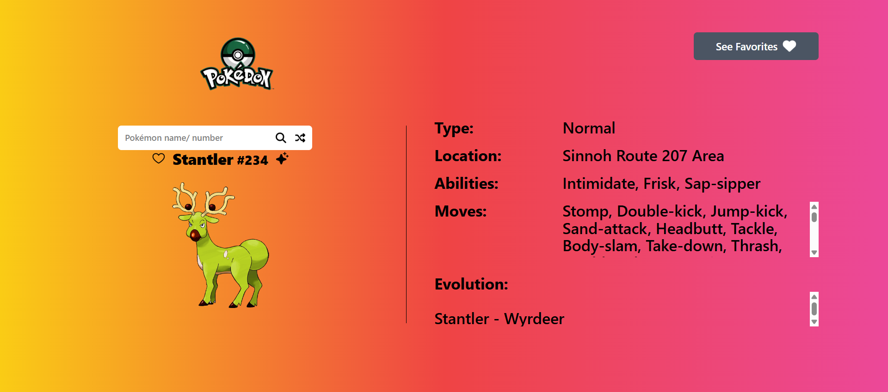

# Pokemon App Rebuild

**Description:** Create a single page pokemon application using the Pokemon API and Next.JS / TypeScript

***Here are the requirements that are needed:***
- Built in Next.JS / TypeScript 
- using the Pokemon API https://pokeapi.co/
- Ability to search by name and Pokedex Number
    - only Gen 1 - 5 pokemon
    - Ability to search by name and Pokedex Number
    - Ability to get a random pokemon
    - image of pokemon and shiny form
    - Pokemon Name
    - show 1 location from any game. If pokemon doesn't have a location, have it return "N/A"
    - Element Typing
    - All possible abilities
    - All possible moves
    - Show Evolutionary Paths, if pokemon doesn't have an evolutionary path, have it return "N/A"
    - Favorites list
- TailWind 
- Have a Prototype in Figma (Desktop, Tablet, Mobile)
- Mobile and Desktop versions must be built out

**Developer:** Michael Heckerman

**Date Revised:** 3/28/25

## Link(s):

[Original Figma](https://www.figma.com/design/LTpU7YtFvvQuylzyliqyDY/Untitled?node-id=0-1&t=ivOgk45xUIBGCYcp-1)

[Github-Repo](https://github.com/mkheck13/rebuildpokemon)

[Vercel](https://rebuildpokemon-o8nj.vercel.app/)

## FeedBack/Peer Review: 

**Reviewer:** (Name Here)

**Comments:** (Comments Here)